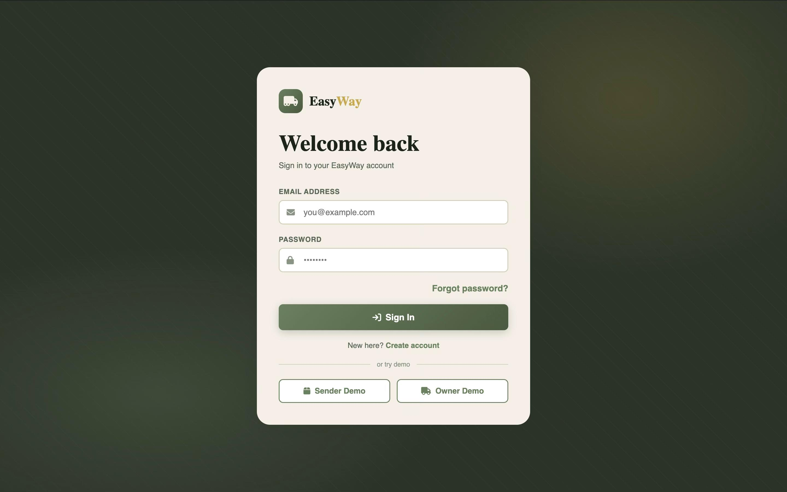
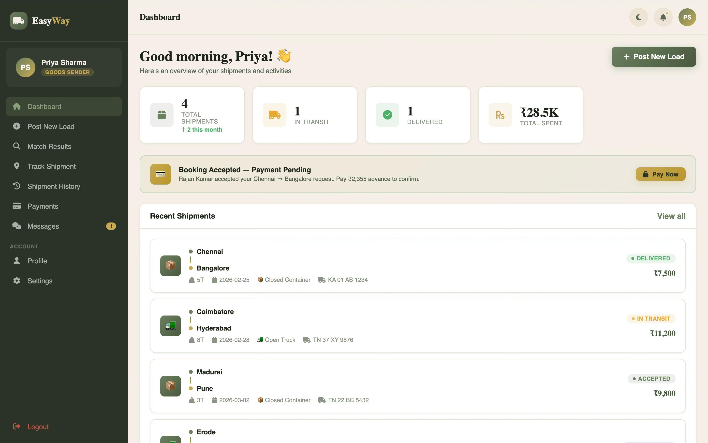
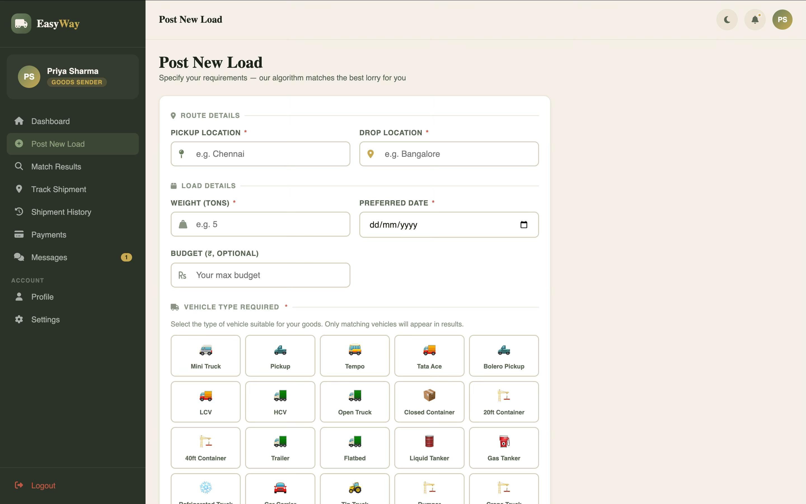
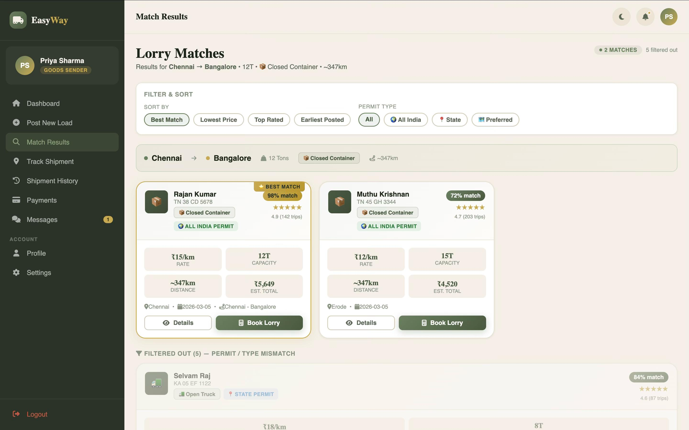
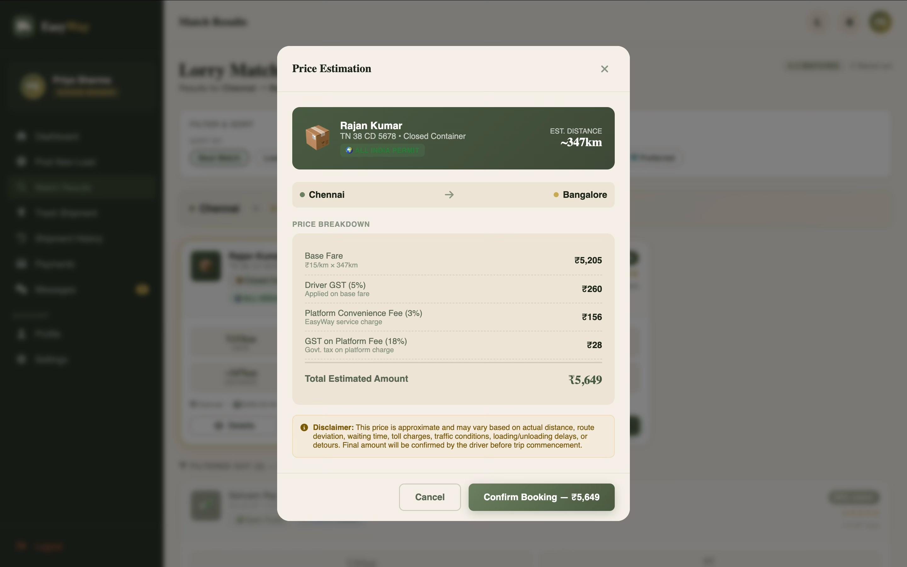
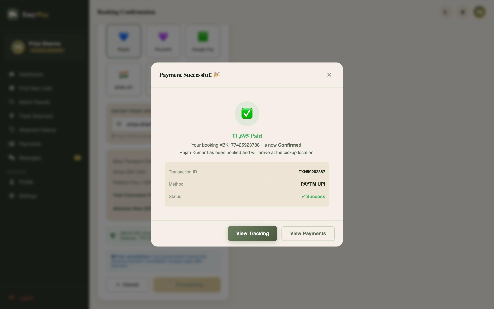
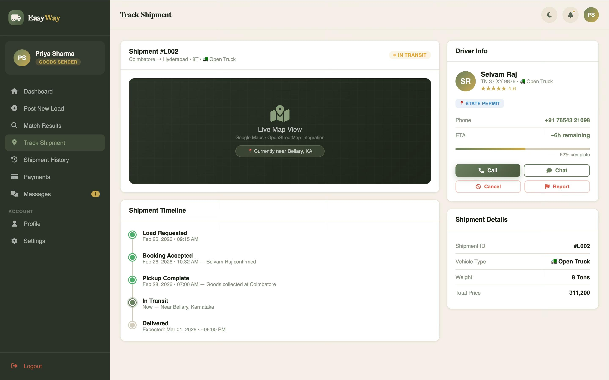
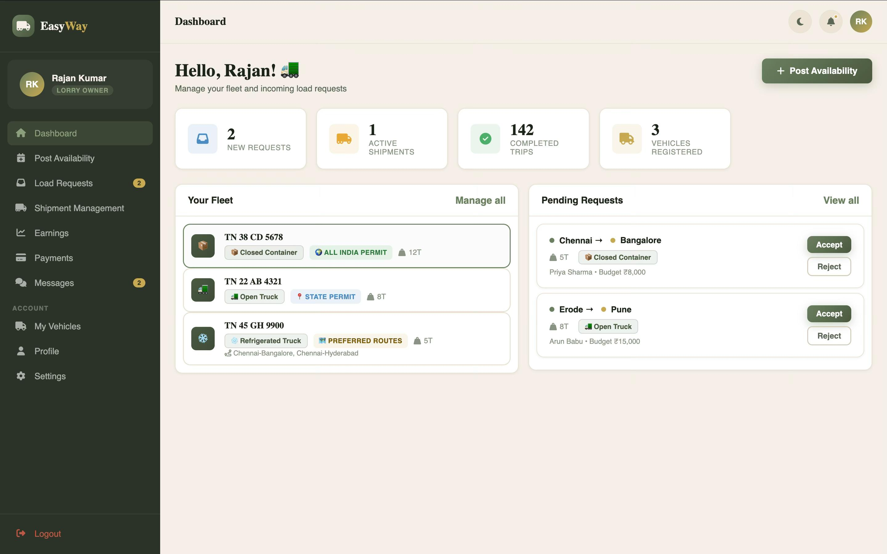
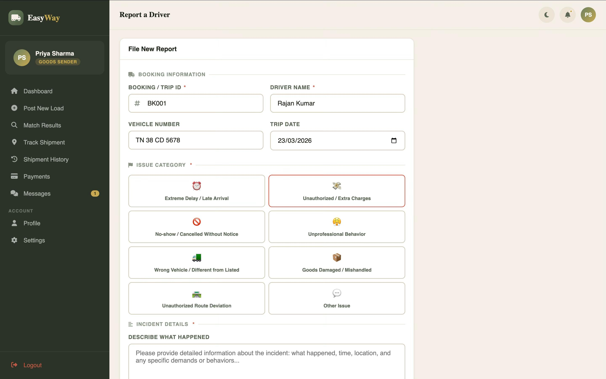

# EasyWay — Programmatic Freight Matching & Dispatch Platform

> **India's unorganised trucking market loses an estimated $10B/year to empty miles and manual brokering.** EasyWay replaces the broker phone call with a constraint-based matching engine, a deterministic fare model, and a state-machine–driven dispatch lifecycle — end to end, in one platform.

[](https://nodejs.org)
[](https://expressjs.com)
[](https://mongodb.com)
[](https://jwt.io)
[](LICENSE)

---

## The Problem

India has over **12 million trucks** but no reliable marketplace connecting freight senders and lorry owners. The current workflow looks like this:

- A factory manager posts a load requirement in a WhatsApp group.
- Three brokers call the same five drivers.
- A truck is selected based on whoever answers first — not capacity, route, or permit compliance.
- The driver quotes a price verbally. There is no fare breakdown, no receipt, no accountability.
- 40% of trucks return empty because nobody coordinated the return leg.

The result: inflated shipping costs, delayed supply chains, and zero paper trail when disputes arise.

**EasyWay models this problem as an engineering challenge.** It treats loads and vehicles as structured objects, applies programmatic matching rules, and automates every stage from quote to delivery confirmation — the same primitives used by Rivigo, BlackBuck, and Porter at scale.

---

## System Overview

The platform operates on a strict **two-actor model**:

| Actor | Role |
|---|---|
| **Sender** | Businesses or individuals who need to move goods. They post load requirements and receive ranked vehicle matches. |
| **Owner** | Lorry owners who register their fleet, declare availability windows, and accept or reject incoming load requests. |

A shipment moves through a deterministic lifecycle:

```
Load Posted → Constraint Matching → Booking Request → Owner Accept/Reject
     → Advance Payment (UPI) → Confirmed → In Transit → Delivered → Final Payment → Completed
```

Every state transition is gated. A booking cannot jump from `pending` to `in_transit`. Contact details (driver phone number, sender phone number) are withheld until the contract is formally accepted. Cancellation penalties are calculated against reason codes — emergencies and breakdowns are waived; no-shows are not.

---

## Architecture

```
┌─────────────────────────────────────────────────────────────┐
│                    Client (SPA — HTML/JS)                   │
│   Sender Portal          │          Owner Portal            │
└──────────────┬───────────┴──────────────┬───────────────────┘
               │  REST API (JSON over HTTP)│
               ▼                          ▼
┌─────────────────────────────────────────────────────────────┐
│                   Express.js API Server                     │
│                                                             │
│  ┌──────────┐  ┌──────────┐  ┌──────────┐  ┌───────────┐  │
│  │   Auth   │  │  Loads   │  │ Bookings │  │ Shipments │  │
│  │ /api/auth│  │/api/loads│  │/api/book │  │/api/ship  │  │
│  └──────────┘  └──────────┘  └──────────┘  └───────────┘  │
│                                                             │
│  ┌──────────┐  ┌──────────┐  ┌──────────┐  ┌───────────┐  │
│  │ Vehicles │  │Availabil.│  │ Payments │  │  Reports  │  │
│  └──────────┘  └──────────┘  └──────────┘  └───────────┘  │
│                                                             │
│  ┌─────────────────────────────────────────────────────┐   │
│  │              Security Layer                         │   │
│  │  Helmet · CORS · Rate Limit · Mongo Sanitize · JWT  │   │
│  └─────────────────────────────────────────────────────┘   │
└──────────────────────────┬──────────────────────────────────┘
                           │ Mongoose ODM
                           ▼
               ┌───────────────────────┐
               │       MongoDB         │
               │  Users · Vehicles     │
               │  Loads · Availability │
               │  Bookings · Payments  │
               │  Shipments · Reports  │
               │  Notifications        │
               └───────────────────────┘
```

**Design decisions:**

- **MongoDB over SQL** — Logistics data is hierarchical and variable. A Booking embeds a `fareBreakdown` subdocument and a `cancellationSchema` inline. Forcing this into relational tables would require 4+ joins per booking fetch. MongoDB's document model maps directly to the domain objects.
- **Stateless JWT + RBAC** — Each request carries a signed token. The `restrictTo('sender')` middleware guards endpoints at the route layer, not the controller layer, so access rules are declared once and impossible to accidentally bypass.
- **Rate limiting at two tiers** — Auth endpoints are throttled at 20 req/15 min. All other API routes at 100 req/15 min. This is not just a nice-to-have: UPI payment initiation endpoints without rate limiting are an open door to transaction flooding.
- **Request body size cap at 10KB** — Prevents payload-based DoS on a Node.js server where JSON parsing is synchronous.

---

## Tech Stack

| Layer | Technology | Why |
|---|---|---|
| **Runtime** | Node.js 18+ | Non-blocking I/O handles concurrent booking state changes without thread contention |
| **Framework** | Express 4.18 | Minimal, composable middleware chain; easy to reason about request flow |
| **Database** | MongoDB + Mongoose 8 | Schema flexibility for nested fare/cancellation objects; compound indexes on `(owner, status)` keep booking queries fast |
| **Auth** | JWT + bcryptjs (salt rounds: 12) | Stateless tokens scale horizontally; bcrypt cost factor 12 provides ~300ms hash time — adequate brute-force resistance |
| **Security** | Helmet, express-mongo-sanitize | HTTP security headers + NoSQL injection prevention; two-line additions that eliminate entire attack classes |
| **Validation** | express-validator | Declarative `loadRules` / `vehicleRules` chains — validation logic lives at the route layer, controllers stay clean |
| **Payments** | UPI deep-link simulation | Models real UPI VPA flow (Paytm, PhonePe, GPay, BHIM) ready to swap for Razorpay/Cashfree webhook in production |
| **Frontend** | Vanilla HTML/CSS/JS (SPA) | Zero build toolchain; demonstrates that clean UI architecture doesn't require a framework |

---

## Screenshots

### Authentication — Role-Segregated Entry Point



*JWT-secured login with explicit role context. Demo paths allow evaluators to explore either actor perspective without registration. Role is encoded into the token payload and enforced at every protected endpoint via `restrictTo()` middleware.*

---

### Sender Dashboard — Operational Command Centre



*Real-time shipment KPIs (total, in-transit, delivered, total spend) surface the most actionable item first — a pending payment banner with a direct CTA. Recent shipments show route, vehicle type, registration number, and live status. This is not decoration; every metric maps directly to a MongoDB aggregation on the `Booking` collection.*

---

### Load Posting — Constraint Ingestion Form



*The vehicle type selector is not cosmetic. The 20+ vehicle classes (Mini Truck → Multi-Axle, Liquid Tanker → Refrigerated) feed directly into the matching algorithm's capacity and type constraint checks. Selecting "Closed Container" eliminates all open-body trucks from results before the query runs.*

---

### Match Results — Constraint-Based Lorry Ranking



*This screen is the core algorithmic output. The engine ran against 7 available vehicles; 5 were filtered out on permit type or vehicle class mismatch (visibly disclosed below the fold). The two qualifying matches are ranked — 98% vs 72% — with rate, capacity, distance, and estimated total surfaced per card. Filtered results are shown transparently, not hidden, demonstrating why they were excluded.*

---

### Price Estimation — Deterministic Fare Engine



*The fare is computed server-side using `calculateFare(distanceKm, ratePerKm)` — not negotiated or estimated by a broker. Every charge component is shown: Base Fare (distance × rate), Driver GST (5%), Platform Fee (3%), GST on Platform Fee (18%). The advance payment (30% of total) and remaining amount are pre-calculated. The user confirms the total before the booking record is created.*

---

### Payment Confirmation — UPI Transaction Receipt



*Post-payment state transition: `accepted` → `confirmed`. The payment controller creates a `Shipment` tracking record on success and fires notifications to both parties. The transaction ID, UPI method, and booking reference are surfaced in a confirmation receipt. In production, this webhook fires from the payment gateway; the simulation confirms or fails based on a `simulateSuccess` flag — a deliberate seam for testing.*

---

### Shipment Tracking — Live Location Timeline



*The tracking view assembles data from three collections: `Shipment.locationHistory` (array of timestamped location updates), `User` (driver contact, rating), and `Booking` (route, fare). The timeline is an audit log — every state transition is a persistent, timestamped append, not an overwrite. The ETA progress bar (52%) and remaining hours surface the `progressPercent` field managed by the owner via the shipment update API.*

---

### Owner Dashboard — Fleet and Request Management



*The owner's view is structurally different from the sender's — it prioritises fleet visibility and pending inbound requests. The "Pending Requests" panel is the owner's primary action surface: two incoming booking requests with route, weight, vehicle type, and sender budget visible before committing. Accepting triggers contact reveal and sender notification in a single atomic operation.*

---

### Dispute System — Structured Incident Reporting



*The dispute system categorises incidents into 8 structured reason codes — not a free-text complaint box. Severity levels (low/medium/high/critical) feed the admin resolution queue. This design mirrors how platforms like Uber Freight and Porter handle driver accountability: structured data enables pattern detection across drivers that unstructured text cannot.*

---

## Core Engineering Features

### Constraint-Based Matching Engine

`GET /api/loads/:id/matches` executes a multi-stage filter against active `Availability` records:

1. **Temporal constraint** — availability date must overlap with load's preferred date
2. **Capacity constraint** — vehicle capacity ≥ load weight (no partial-load matching)
3. **Vehicle type constraint** — exact type match against the sender's declared requirement
4. **Permit constraint** — interstate routes reject vehicles with state-only or local permits
5. **Preference scoring** — vehicles whose `preferredAreas` array intersects with the pickup/drop cities rank higher

Rejected candidates are returned in the response with their rejection reason — the frontend displays them transparently so the sender understands why alternatives were filtered.

### Fare Calculation Engine

```
baseFare        = distance(km) × ratePerKm
driverGST       = baseFare × 5%
platformFee     = baseFare × 3%
platformGST     = platformFee × 18%
totalEstimated  = baseFare + driverGST + platformFee + platformGST
advanceAmount   = totalEstimated × 30%
remainingAmount = totalEstimated − advanceAmount
```

All rates are environment-configurable (`GST_DRIVER_RATE`, `PLATFORM_FEE_RATE`, etc.), so the pricing model can be adjusted without touching application code.

### Booking State Machine

```
pending ──► accepted ──► confirmed ──► in_transit ──► delivered ──► completed
   │            │              │
   └──► rejected └──► cancelled └──► cancelled (with penalty)
```

State transitions are enforced at the controller level. A `confirmed` booking cannot be `accepted` again. Cancellation after payment applies a penalty calculated from the reason code — `breakdown`, `emergency`, `weather`, and `route_issue` are waived; all others incur 10% of the booking total (floored at ₹500, capped at ₹1,500).

### Privacy Gate

Phone numbers are PII. EasyWay withholds them until the booking contract is formed:

- **Before acceptance**: neither party sees the other's phone number.
- **On owner accept**: `senderContactRevealed = true` — the owner receives the sender's phone in the acceptance response.
- **On sender view of accepted/confirmed booking**: owner's phone is included in the response.

This is enforced in `getBooking()` via explicit field deletion on the response object — not a schema-level default that could be bypassed by a different query path.

### UPI Payment Simulation

The payment flow generates a real UPI deep-link (`upi://pay?pa=...`) targeting the platform's VPA for the selected app (Paytm, PhonePe, Google Pay, BHIM). In the simulation, a `confirmPayment` endpoint accepts a `simulateSuccess` boolean — `false` returns a `402` failure, allowing the full failure path to be tested. The production swap is a single webhook replacement with no business logic changes required.

---

## What Makes This Different

Most logistics projects built as portfolio work are CRUD applications with a "logistics" label. This system is different in three specific ways:

**1. The matching engine rejects candidates with reasons.** It doesn't just return matches — it returns filtered-out candidates with explicit rejection codes. This is architecturally correct: in a real marketplace, a sender needs to know *why* a truck was excluded, not just which ones qualified.

**2. Financial calculations are deterministic and auditable.** The fare breakdown is computed server-side and stored as a `fareBreakdown` subdocument on the `Booking` record at creation time. This means the price the sender saw is the price that was booked — no renegotiation, no drift. This is a non-trivial engineering decision that most implementations miss.

**3. The system models real B2B trust primitives.** Contact details are withheld pre-contract. Cancellation penalties have a waiver list for force majeure events. Disputes are structured, not freeform. These aren't UI flourishes — they exist because real freight contracts have these clauses, and the system encodes them as code.

---

## Running Locally

**Prerequisites:** Node.js ≥ 18, MongoDB (local or Atlas)

```bash
# 1. Clone
git clone https://github.com/romesh45/easyway-logistics.git
cd easyway-logistics

# 2. Install dependencies
npm install

# 3. Configure environment
cp .env.example .env
# Edit .env: set MONGO_URI, JWT_SECRET

# 4. Seed demo data
npm run seed

# 5. Start development server
npm run dev
# API running at http://localhost:5001
# Frontend at http://localhost:5001 (served as static SPA)
```

**Demo accounts (created by seed):**

| Role | Email | Password |
|---|---|---|
| Sender | sender@demo.com | password123 |
| Owner | owner@demo.com | password123 |

---

## API Reference (Selected Endpoints)

| Method | Endpoint | Role | Description |
|---|---|---|---|
| `POST` | `/api/auth/register` | Public | Register as sender or owner |
| `POST` | `/api/auth/login` | Public | Authenticate, receive JWT |
| `POST` | `/api/loads` | Sender | Post a load requirement |
| `GET` | `/api/loads/:id/matches` | Sender | Run constraint matching, get ranked results |
| `POST` | `/api/bookings` | Sender | Create booking from a match |
| `PUT` | `/api/bookings/:id/accept` | Owner | Accept booking, reveal contacts |
| `PUT` | `/api/bookings/:id/cancel` | Both | Cancel with reason code + penalty logic |
| `POST` | `/api/payments/initiate` | Sender | Initiate UPI advance payment |
| `POST` | `/api/payments/:id/confirm` | Sender | Confirm payment, create shipment record |
| `PUT` | `/api/shipments/:id/location` | Owner | Append location update to history |
| `GET` | `/api/reports` | Both | Fetch filed dispute reports |

Full route definitions in [`routes/index.js`](routes/index.js).

---

## Learning Outcomes

Building this required reasoning about problems that standard tutorials do not cover:

- **Modelling business rules as code constraints** — permit types, capacity limits, and privacy gates are not UI logic. They live in the data layer and the API layer, so they cannot be bypassed.
- **State machine design** — defining which transitions are legal, what side effects each transition triggers (notifications, shipment record creation, contact reveal), and how to handle invalid transitions gracefully.
- **Financial precision in software** — storing fare components as separate fields instead of a single total, so breakdowns can be audited, disputed, or recalculated without recomputing from scratch.
- **Security as architecture** — rate limiting, NoSQL injection prevention, and PII gating are not afterthoughts added at the end. They are structural decisions that affect the schema and the middleware chain.

---

## Roadmap

**v2.0 — Real Geospatial Matching**
Replace the city-distance lookup table with `MongoDB $geoNear` queries. Senders input coordinates; the matching engine finds vehicles within a configurable radius using proper spherical distance calculation.

**v2.1 — Live Tracking via WebSockets**
Replace the polling-based tracking view with `Socket.io` rooms per booking ID. The owner's mobile app emits GPS coordinates; the sender's browser receives real-time position updates without polling.

**v2.2 — Background Job Queue**
Move notification dispatch (email, SMS) off the request thread into a `BullMQ` worker queue backed by Redis. Current synchronous `sendNotification()` calls add latency to booking state transitions.

**v2.3 — Payment Gateway Integration**
Swap the UPI simulation for a live Razorpay or Cashfree webhook. The payment controller is already structured as a seam — `confirmPayment` only needs the webhook handler replaced; all downstream booking and shipment logic is unchanged.

**v3.0 — Microservices Decomposition**
At scale, the matching engine, payment service, and notification service should be independent deployable units. The current monolith is structured with clear domain boundaries (controllers per domain, no cross-domain imports) to make this decomposition straightforward.

---

## Project Structure

```
easyway-logistics/
├── config/
│   └── db.js                  # MongoDB connection with retry logic
├── controllers/
│   ├── authController.js      # Register, login, profile
│   ├── bookingController.js   # Full booking lifecycle
│   ├── loadController.js      # Load CRUD + matching engine
│   ├── paymentController.js   # UPI initiation + confirmation
│   ├── shipmentController.js  # Location updates + tracking
│   ├── vehicleController.js   # Fleet management
│   ├── availabilityController.js
│   └── reportController.js    # Dispute filing + resolution
├── middleware/
│   ├── auth.js                # JWT verification + RBAC
│   ├── validate.js            # express-validator rule chains
│   └── errorHandler.js        # Centralised error formatting
├── models/
│   ├── User.js                # Dual-role schema, bcrypt pre-save
│   ├── Booking.js             # State machine + fare subdocument
│   ├── Shipment.js            # Location history array + Report
│   ├── Vehicle.js             # 23 vehicle types, permit validation
│   ├── Load.js
│   ├── Availability.js
│   ├── Payment.js
│   └── Notification.js
├── routes/
│   ├── auth.js
│   ├── vehicles.js
│   └── index.js               # All domain routers
├── utils/
│   ├── helpers.js             # Fare engine, distance table, JWT, penalty
│   └── seed.js                # Demo data generator
├── public/
│   └── index.html             # Single-page frontend application
└── server.js                  # Entry point, middleware stack, graceful shutdown
```

---

## Screenshot → File Mapping

Place these files in a `docs/screenshots/` directory in the repository root:

| Filename | Screen |
|---|---|
| `01_auth_role_selection.jpeg` | Login screen with Sender / Owner demo buttons |
| `02_sender_dashboard.jpeg` | Sender dashboard with KPIs and recent shipments |
| `03_load_posting_form.jpeg` | Post New Load form with vehicle type selector |
| `04_match_results_ranked.jpeg` | Match results with scored matches and filtered-out list |
| `05_fare_breakdown_engine.jpeg` | Price estimation modal with full fare breakdown |
| `06_payment_confirmation_upi.jpeg` | Payment successful modal with transaction receipt |
| `07_shipment_tracking_live.jpeg` | Track Shipment view with timeline and driver panel |
| `08_owner_fleet_dashboard.jpeg` | Owner dashboard with fleet and pending requests |
| `09_dispute_report_form.jpeg` | Report a Driver form with categorised issue types |

---

*Built to model real freight marketplace architecture — not as an academic exercise, but as a working prototype of the systems that move physical goods across India.*
