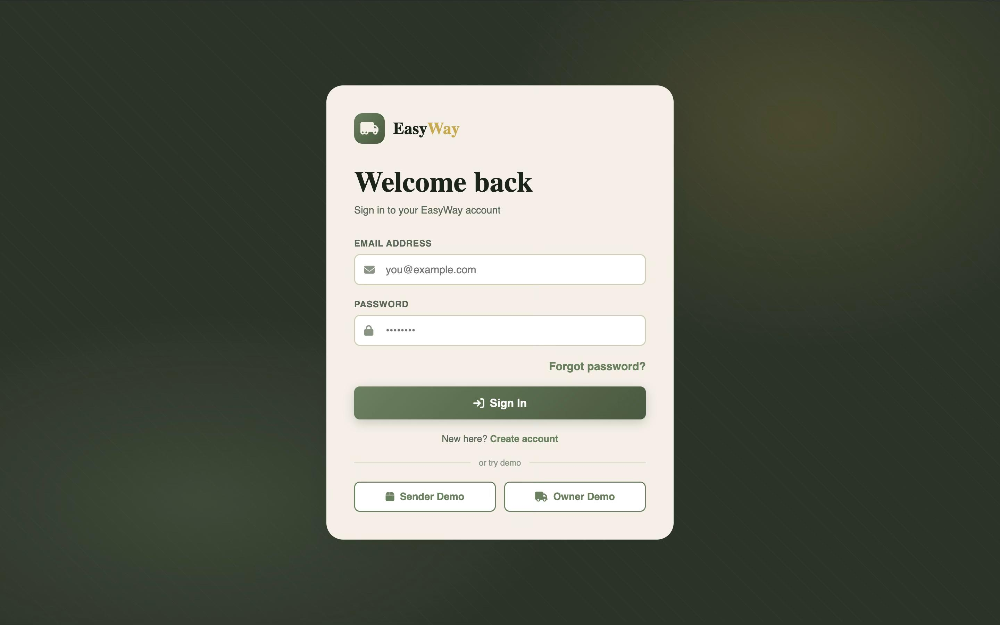
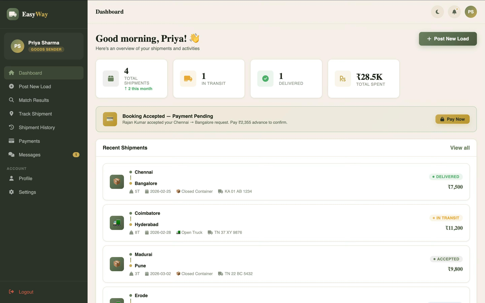
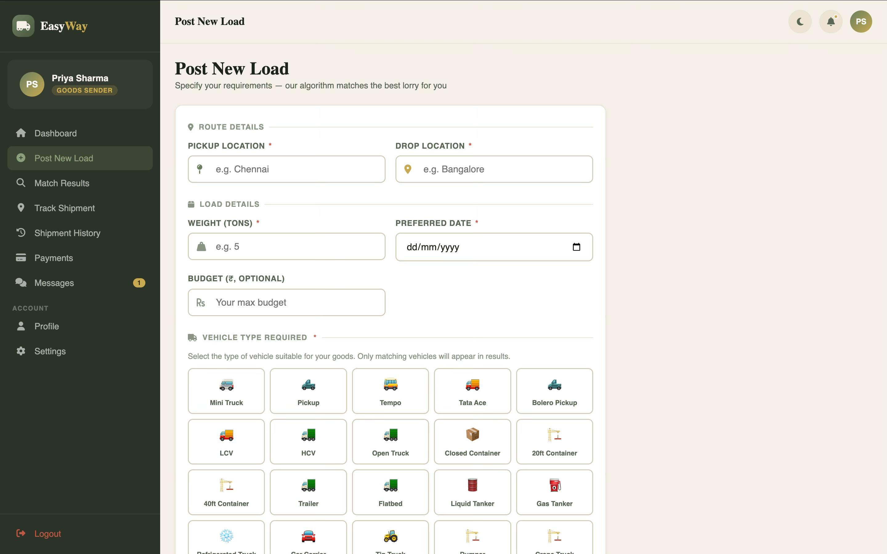
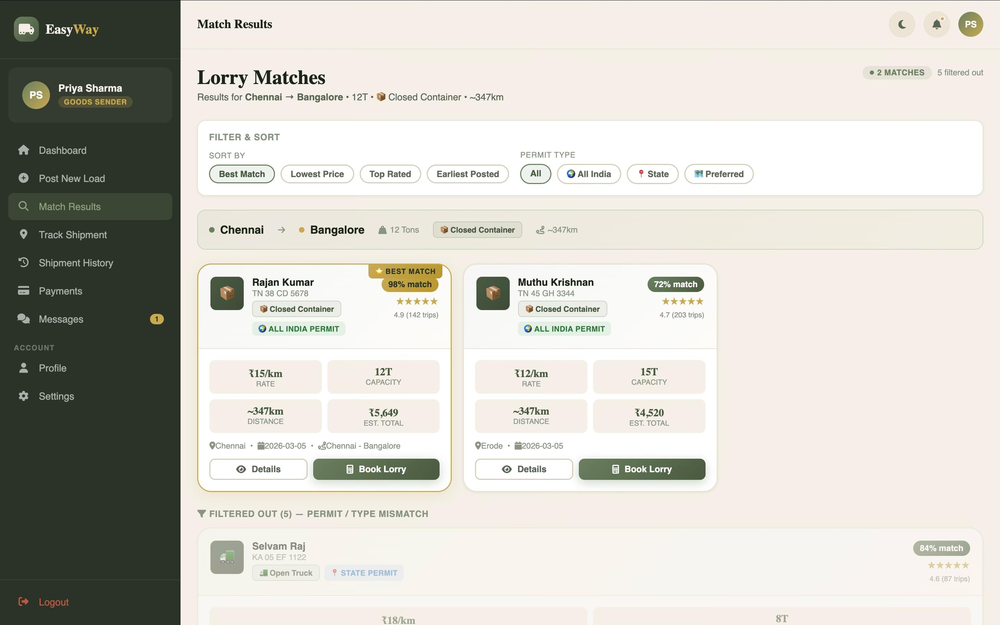
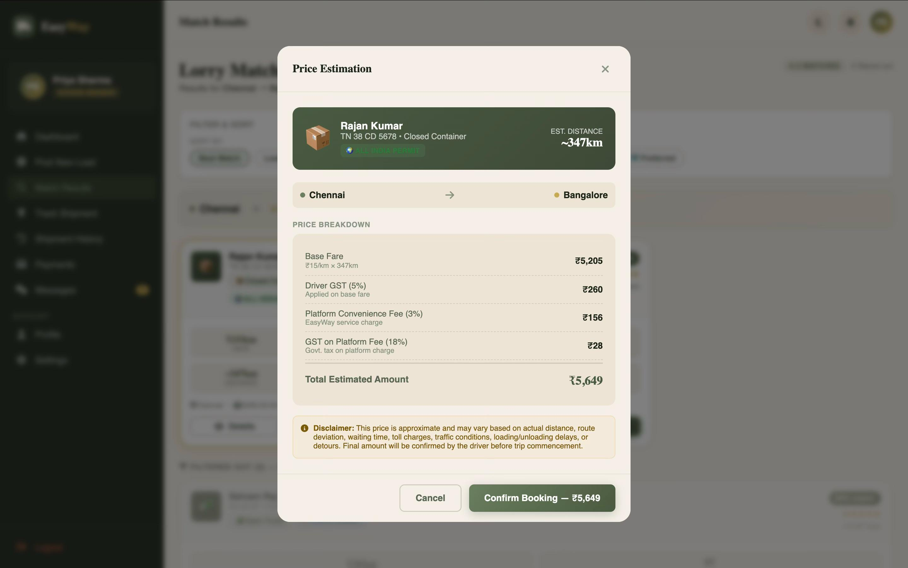
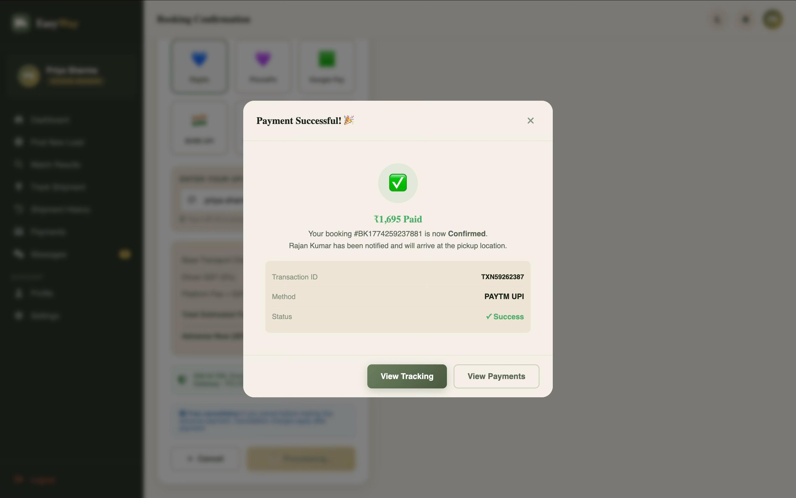
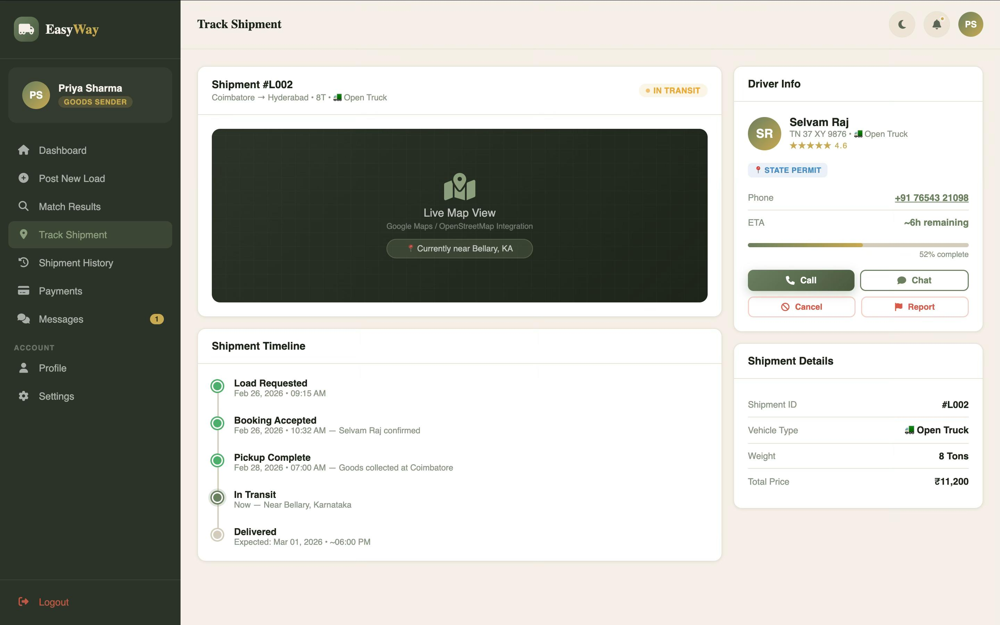
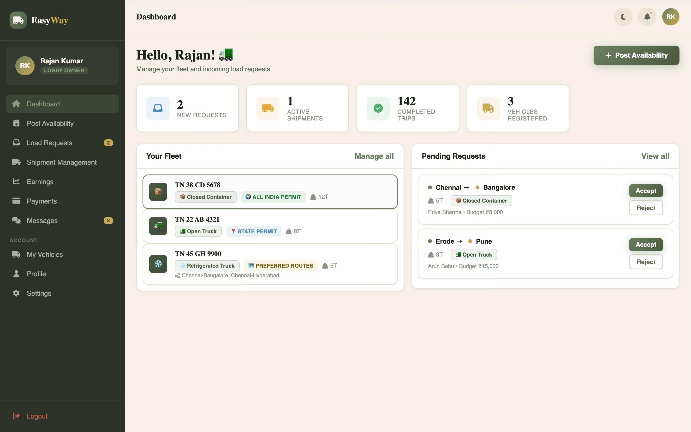
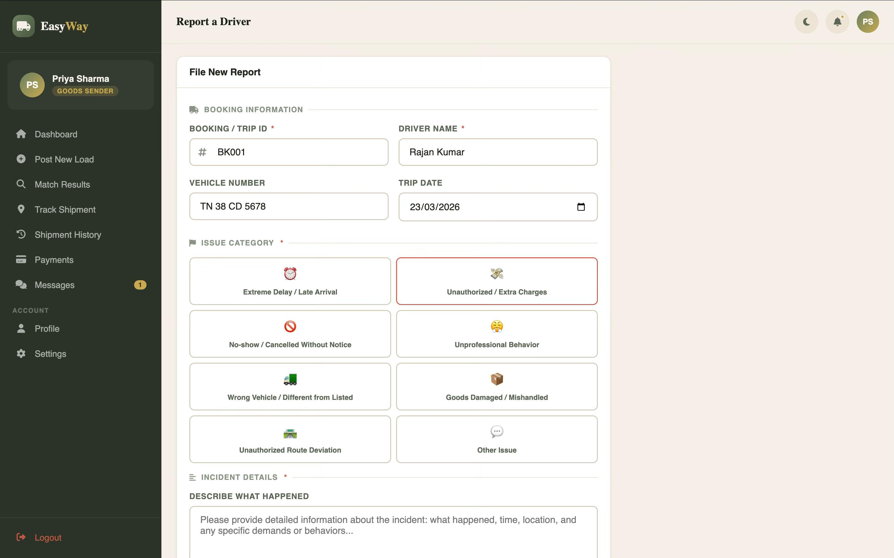

# EasyWay 🚛

> A full-stack logistics platform that connects cargo senders with lorry owners — replacing informal broker networks with transparent pricing, verified bookings, and real-time shipment tracking.


**🌐 Live Demo → [easyway-logistics.onrender.com](https://easyway-logistics.onrender.com)**

---

## Overview

India's freight industry moves largely through informal broker networks where pricing is opaque, agreements are verbal, and dispute resolution is nonexistent. A lorry owner and a cargo sender can agree on a rate over the phone, but there is no paper trail, no penalty for cancellation, and no way to verify contact details before both parties commit.

EasyWay replaces this with a structured two-sided marketplace. Senders post loads with weight, route, and vehicle requirements. Lorry owners post their availability with a per-km rate. A deterministic matching engine ranks available lorries by a composite score that weighs capacity fit, route preference, date proximity, and budget alignment. Once a booking is accepted, both parties' contact numbers are unlocked, advance payment is processed through UPI, and a shipment tracking record is created automatically. Cancellations carry configurable penalties based on the reason code and payment stage.

---

## Screenshots

### Authentication & Role Selection


### Sender Dashboard


### Load Posting Form


### Match Results — Ranked by Score


### Fare Breakdown Engine


### Payment Confirmation — UPI


### Shipment Tracking — Live


### Owner Fleet Dashboard


### Dispute & Report Form


---

## Architecture

```
┌─────────────────────────────────────────────────────────────┐
│                    Browser (Single Page App)                 │
│              HTML5 · Vanilla JS · CSS Variables              │
└──────────────────────────┬──────────────────────────────────┘
                           │ HTTPS REST  (Bearer JWT)
┌──────────────────────────▼──────────────────────────────────┐
│                    Express.js API Server                     │
│                                                              │
│  ┌─────────────────┐  ┌─────────────┐  ┌─────────────────┐ │
│  │  Rate Limiting   │  │  JWT Auth   │  │ Input Validation│ │
│  │ /api:  100/15min │  │  protect()  │  │ express-valid.  │ │
│  │ /auth:  20/15min │  │ restrictTo()│  │ per-route rules │ │
│  └─────────────────┘  └─────────────┘  └─────────────────┘ │
│                                                              │
│  ┌─────────────────────────────────────────────────────┐    │
│  │  helmet · mongoSanitize · cors · morgan (dev)        │    │
│  └─────────────────────────────────────────────────────┘    │
│                                                              │
│  Routes:  auth · loads · bookings · payments                 │
│           shipments · vehicles · availability                │
│           notifications · reports                            │
└──────────────────────────┬──────────────────────────────────┘
                           │ Mongoose ODM
┌──────────────────────────▼──────────────────────────────────┐
│                         MongoDB Atlas                        │
│  Collections: Users · Loads · Bookings · Payments            │
│               Shipments · Vehicles · Availability            │
│               Notifications · Reports                        │
└─────────────────────────────────────────────────────────────┘
```

### Booking Lifecycle State Machine

```
[Sender: POST /loads]
        │
        ▼
    Load: open
        │
        │  [Sender: POST /bookings]
        ▼
    Load: booked ──────── Availability: booked
    Booking: pending
        │
        ├──[Owner: reject]──► Booking: rejected
        │                     Load: open (re-opened)
        │                     Availability: active (re-opened)
        │
        │  [Owner: accept]
        ▼
    Booking: accepted
    (both contacts revealed)
        │
        │  [Sender: POST /payments/initiate → /confirm]
        ▼
    Booking: confirmed
    Shipment: accepted  ◄─── (created on payment confirmation)
        │
        │  [Owner: PUT /shipments/:id/status → in_transit]
        ▼
    Booking: in_transit
    Shipment: in_transit
        │
        │  [Owner: PUT /shipments/:id/location  (repeatable)]
        │
        │  [Owner: PUT /shipments/:id/status → delivered]
        ▼
    Booking: delivered
    Shipment: delivered
        │
        │  [PUT /shipments/:id/status → completed]
        ▼
    Booking: completed
    Shipment: completed

    ─── Cancellation (any active state) ───────────────────────
    [Either party: PUT /bookings/:id/cancel]
        │
        ├── No penalty  (not yet confirmed, or waivable reason:
        │               breakdown / emergency / weather / route_issue)
        └── Penalty     (10% of total, clamped ₹500–₹1,500)
```

---

## Tech Stack

| Layer | Technology | Decision |
|-------|------------|----------|
| Runtime | Node.js 18+ | LTS stream; native `AbortController`, async/await without polyfills |
| Framework | Express.js 4 | Mature middleware ecosystem; Fastify's schema-first approach adds friction for a REST API with domain-specific cross-field validation rules |
| Database | MongoDB / Mongoose | Shipment data is document-shaped (nested location history array, fare breakdown subdocument); joins across bounded domains are rare, making a relational model's referential overhead unjustified |
| Auth | JSON Web Tokens | Stateless — no session store to scale or synchronise; 7-day expiry with `TokenExpiredError` handled at both the `protect` middleware and the global error handler |
| Password hashing | bcryptjs | Salt rounds set to 12 — deliberately CPU-bound to throttle brute-force; pure-JS implementation avoids native binding compilation failures in CI environments |
| Input validation | express-validator | Declarative, composable rule chains; custom validators (pickup ≠ drop, date must be future, vehicleType enum) are defined once in `validate.js` and assembled into route-level middleware |
| Security headers | helmet | Configures 11 HTTP security headers in one call; `crossOriginResourcePolicy: cross-origin` tuned for the same-server SPA |
| NoSQL injection | express-mongo-sanitize | Strips `$` and `.` from user-supplied keys before they reach any Mongoose query |
| Rate limiting | express-rate-limit | Two tiers: 100 req/15min globally on `/api`; 20 req/15min specifically on `/api/auth` to slow credential-stuffing |
| Frontend | Vanilla JS SPA | No build pipeline — the entire client is `public/index.html`, served statically by Express; eliminates a separate dev server, build step, and frontend module tree |
| ODM | Mongoose | Schema-level validation as a second line of defence behind express-validator; compound indexes defined per model file |

---

## Key Engineering Decisions

- **Layered validation** — express-validator rules run at the route layer (format, presence, enum membership, cross-field constraints such as pickup ≠ drop and date must be future). Mongoose schema validators run inside `save()` as a second pass. The global error handler normalises both into the same `{ success, message, errors[] }` envelope so the frontend has one code path regardless of which layer rejected the input.

- **Deterministic fare engine** — `calculateFare(distanceKm, ratePerKm)` reads all four rates from environment variables with hardcoded fallbacks, performs integer rounding at each step, and is a pure function: the same inputs always produce the same output. All six output fields are snapshotted onto the Booking's `fareBreakdown` subdocument at creation time and never recalculated — a rate change does not affect existing bookings.

- **Permit-aware matching** — `permitAllowsRoute()` distinguishes between `all_india`, `state`, `local`, and `preferred` permit types. Vehicles with `preferred` permits carry a `preferredAreas` array parsed from a comma-separated string at save time via a pre-save hook. Vehicles that fail the permit check appear in an `excluded[]` array in the match response with a human-readable reason — they are not silently dropped.

- **Contact reveal gating** — phone numbers live on the User document behind `select: false`. After a booking is accepted, `senderContactRevealed` and `ownerContactRevealed` flags are set on the Booking. The `GET /bookings/:id` controller checks these flags and conditionally attaches the phone number to the response — the number is never transmitted unless the booking is in an appropriate state and the requesting user is the correct party.

- **Server-enforced status transitions** — `VALID_TRANSITIONS` in `shipmentController.js` is an explicit map: `accepted → [in_transit]`, `in_transit → [delivered]`, `delivered → [completed]`. Any other transition returns 400 with the exact rejected path. Status changes on Shipment are mirrored onto Booking, keeping both documents consistent without a transaction.

- **Cancellation penalty by reason code** — `calculatePenalty()` inspects the `reasonCode` against a fixed waivable list (`breakdown`, `emergency`, `weather`, `route_issue`). Waivable reasons return zero amount with `penaltyWaived: true`. All other codes charge 10% of the booking total, clamped between `CANCELLATION_PENALTY_MIN` and `CANCELLATION_PENALTY_MAX`. The penalty decision, amount, waiver flag, and reason are stored on `booking.cancellation` for a full audit trail.

- **Soft deletes throughout** — Vehicles are deactivated (`isActive: false`), not removed. The `protect` middleware rejects deactivated user accounts with 401 before the request reaches any route. This preserves referential integrity for historical bookings and payments without orphaning foreign key references.

- **Dual rate limiting** — A global limiter at 100 req/15min is mounted on `/api`. A separate stricter limiter at 20 req/15min is mounted specifically on `/api/auth`. Both use `standardHeaders: true` per RFC 6585. Because they are separate middleware instances with separate stores, neither can be bypassed by manipulating the path.

---

## API Reference

All endpoints require `Authorization: Bearer <token>` unless marked **Public**.

### Auth  `/api/auth`

| Method | Endpoint | Auth | Description |
|--------|----------|------|-------------|
| POST | `/register` | Public | Register a new sender or owner account |
| POST | `/login` | Public | Authenticate and receive a JWT |
| GET | `/me` | ✓ | Return the authenticated user's profile |
| PUT | `/profile` | ✓ | Update fullName, phone, company, address, settings |
| PUT | `/change-password` | ✓ | Validate current password, set new password |
| DELETE | `/account` | ✓ | Soft-deactivate the account (`isActive: false`) |

### Vehicles  `/api/vehicles`

| Method | Endpoint | Auth | Role | Description |
|--------|----------|------|------|-------------|
| GET | `/` | ✓ | Owner | List all active vehicles; primary vehicle sorted first |
| POST | `/` | ✓ | Owner | Register a vehicle (first vehicle auto-sets `isPrimary: true`) |
| GET | `/:id` | ✓ | Owner | Get a single vehicle by ID |
| PUT | `/:id` | ✓ | Owner | Update vehicle attributes |
| DELETE | `/:id` | ✓ | Owner | Soft-deactivate (`isActive: false`) |

### Loads  `/api/loads`

| Method | Endpoint | Auth | Role | Description |
|--------|----------|------|------|-------------|
| POST | `/` | ✓ | Sender | Post a new load |
| GET | `/` | ✓ | Sender | List own loads with optional `status` filter and pagination |
| GET | `/:id` | ✓ | Any | Get load detail |
| PUT | `/:id` | ✓ | Sender | Update an `open` load |
| DELETE | `/:id` | ✓ | Sender | Cancel an `open` load |
| GET | `/:id/matches` | ✓ | Sender | Run matching engine — returns scored `matches[]` and `excluded[]` with reasons |

### Availability  `/api/availability`

| Method | Endpoint | Auth | Role | Description |
|--------|----------|------|------|-------------|
| POST | `/` | ✓ | Owner | Post lorry availability with location, date, and rate |
| GET | `/mine` | ✓ | Owner | List own availability records sorted by date |
| PUT | `/:id` | ✓ | Owner | Update an availability record |
| DELETE | `/:id` | ✓ | Owner | Expire a record (`status: expired`) |

### Bookings  `/api/bookings`

| Method | Endpoint | Auth | Role | Description |
|--------|----------|------|------|-------------|
| POST | `/` | ✓ | Sender | Create booking from loadId + availabilityId |
| GET | `/` | ✓ | Any | List own bookings; supports `status` filter and pagination |
| GET | `/:id` | ✓ | Any | Get booking detail; conditionally includes revealed contact numbers |
| PUT | `/:id/accept` | ✓ | Owner | Accept a pending booking; sets contact reveal flags |
| PUT | `/:id/reject` | ✓ | Owner | Reject; re-opens load and availability |
| PUT | `/:id/cancel` | ✓ | Any | Cancel with `reason` + `reasonCode`; applies or waives penalty |

### Payments  `/api/payments`

| Method | Endpoint | Auth | Role | Description |
|--------|----------|------|------|-------------|
| POST | `/initiate` | ✓ | Sender | Create a `processing` payment record; returns UPI deep-link |
| POST | `/:paymentId/confirm` | ✓ | Sender | Mark payment `success`; sets Booking to `confirmed`; creates Shipment |
| GET | `/` | ✓ | Any | Payment history with total-paid summary |
| GET | `/booking/:bookingId` | ✓ | Any | All payments for a specific booking |

### Shipments  `/api/shipments`

| Method | Endpoint | Auth | Role | Description |
|--------|----------|------|------|-------------|
| GET | `/` | ✓ | Any | List own shipments filtered by role |
| GET | `/:bookingId` | ✓ | Any | Get shipment with full location history |
| PUT | `/:bookingId/status` | ✓ | Owner | Advance status via `VALID_TRANSITIONS` map |
| PUT | `/:bookingId/location` | ✓ | Owner | Append location update to history (only when `in_transit`) |

### Reports  `/api/reports`

| Method | Endpoint | Auth | Role | Description |
|--------|----------|------|------|-------------|
| POST | `/` | ✓ | Sender | File a complaint; one active report per booking enforced |
| GET | `/mine` | ✓ | Sender | List own submitted reports |
| GET | `/:id` | ✓ | Sender | Get a single report |

### Notifications  `/api/notifications`

| Method | Endpoint | Auth | Description |
|--------|----------|------|-------------|
| GET | `/` | ✓ | Fetch notifications; response includes `unreadCount` |
| PUT | `/mark-read` | ✓ | Mark as read — pass `ids: [...]` array or `ids: "all"` |

---

## Data Models

### User
```
_id         ObjectId
fullName    String (max 100)
email       String (unique, lowercase)
phone       String (10–15 digit validated)
password    String (bcrypt salt 12, select: false)
role        Enum ['sender', 'owner']
rating      Number (1.0–5.0, default 5.0)
totalTrips  Number
isActive    Boolean  (soft delete flag)
lastLogin   Date
```

### Load
```
_id               ObjectId
sender            → User
pickup, drop      String  (pickup ≠ drop enforced at validation layer)
weight            Number  (0.1–500 tons)
preferredDate     Date    (must be today or future)
vehicleType       Enum    (23 types)
budget            Number  (optional sender budget cap)
status            Enum    ['open', 'matched', 'booked', 'cancelled']

Indexes: { sender, status }, { status }, { vehicleType, status }, { preferredDate }
```

### Booking
```
_id                  ObjectId
bookingRef           String  (unique; auto: 'BK' + timestamp slice)
sender, owner        → User
vehicle              → Vehicle
load, availability   → Load, Availability
fareBreakdown        { baseFare, driverGST, platformFee, platformGST,
                       totalEstimated, advanceAmount, remainingAmount }
status               Enum    ['pending', 'accepted', 'confirmed', 'in_transit',
                              'delivered', 'completed', 'cancelled', 'rejected']
senderContactRevealed, ownerContactRevealed  Boolean
cancellation         { cancelledBy, reason, reasonCode, penaltyApplied,
                       penaltyAmount, penaltyWaived, cancelledAt }

Indexes: { sender, status }, { owner, status }
```

### Payment
```
_id             ObjectId
transactionRef  String  (unique; auto: 'TXN' + timestamp)
booking         → Booking
payer, payee    → User
amount          Number
type            Enum  ['advance', 'final', 'penalty', 'refund']
method          Enum  ['paytm', 'phonepe', 'gpay', 'bhim', 'amazonpay', 'other_upi']
status          Enum  ['pending', 'processing', 'success', 'failed', 'refunded']
processedAt     Date

Indexes: { booking, type }, { payer, status }
```

### Shipment
```
_id               ObjectId  (1:1 with Booking — unique index)
booking           → Booking
sender, owner     → User
status            Enum  ['accepted', 'in_transit', 'delivered', 'completed']
currentLocation   String
locationHistory   [{ location, note, timestamp }]  (append-only)
progressPercent   Number  (0–100)
estimatedDelivery Date
actualDelivery    Date
```

---

## Local Development

```bash
# 1. Clone
git clone https://github.com/romesh45/easyway-logistics.git
cd easyway-logistics

# 2. Install dependencies
npm install

# 3. Configure environment
cp .env.example .env
# Edit .env — set MONGO_URI and JWT_SECRET at minimum

# 4. Seed the database
npm run seed
# Creates demo users, vehicles, loads, availabilities, and bookings

# 5. Start the server
npm run dev     # nodemon — restarts on file change
npm start       # node server.js — production mode

# API:          http://localhost:5001/api
# Frontend:     http://localhost:5001
# Health check: http://localhost:5001/api/health
```

### Demo Credentials (after seeding)

| Role | Email | Password |
|------|-------|----------|
| Sender | priya@demo.com | demo@1234 |
| Sender | kavitha@demo.com | demo@1234 |
| Owner | rajan@demo.com | demo@1234 |
| Owner | selvam@demo.com | demo@1234 |

### Environment Variables

| Variable | Default | Description |
|----------|---------|-------------|
| `PORT` | `5001` | HTTP server port |
| `NODE_ENV` | `development` | Controls morgan logging and error stack traces |
| `MONGO_URI` | — | Full MongoDB connection string |
| `JWT_SECRET` | — | JWT signing secret — use a cryptographically random string in production |
| `JWT_EXPIRES_IN` | `7d` | JWT lifetime |
| `CLIENT_ORIGIN` | `http://127.0.0.1:5500` | Primary allowed CORS origin |
| `GST_DRIVER_RATE` | `0.05` | GST applied to base fare (5%) |
| `PLATFORM_FEE_RATE` | `0.03` | Platform commission on base fare (3%) |
| `GST_PLATFORM_RATE` | `0.18` | GST applied to the platform fee (18%) |
| `ADVANCE_PAYMENT_PCT` | `0.30` | Fraction of total fare due as advance (30%) |
| `CANCELLATION_PENALTY_MIN` | `500` | Minimum cancellation penalty in ₹ |
| `CANCELLATION_PENALTY_MAX` | `1500` | Maximum cancellation penalty in ₹ |
| `RATE_LIMIT_WINDOW_MS` | `900000` | Rate limit window in ms (15 minutes) |
| `RATE_LIMIT_MAX` | `100` | Max requests per window per IP |

---

## Project Structure

```
easyway-logistics/
├── controllers/
│   ├── authController.js         # Register, login, profile, password change, deactivate
│   ├── loadController.js         # CRUD + matching engine (computeMatchScore, permitAllowsRoute)
│   ├── bookingController.js      # Create, accept, reject, cancel with penalty logic
│   ├── paymentController.js      # Initiate, confirm, UPI deep-link generation
│   ├── shipmentController.js     # VALID_TRANSITIONS enforcement, location history
│   ├── vehicleController.js      # CRUD with duplicate number check and isPrimary auto-set
│   ├── availabilityController.js # Owner availability management
│   ├── notificationController.js # Fetch with unreadCount, bulk and targeted mark-read
│   └── reportController.js       # File complaint, active-report dedup check
│
├── models/
│   ├── User.js          # bcrypt pre-save hook, comparePassword(), toSafeObject()
│   ├── Load.js          # 23-type vehicleType enum, compound indexes
│   ├── Booking.js       # 8-state lifecycle, fareBreakdown subdoc, contact reveal flags
│   ├── Vehicle.js       # preferredRoutes → preferredAreas pre-save parse hook
│   ├── Availability.js  # Rate and location snapshot for the matching engine
│   ├── Payment.js       # Gateway simulation fields, payer/payee refs
│   ├── Notification.js  # Compound index on { recipient, isRead, createdAt }
│   └── Shipment.js      # locationHistory array, 1:1 with Booking (unique index)
│
├── routes/
│   ├── auth.js           # Public register/login + protect-gated profile routes
│   ├── vehicles.js       # All routes: protect + restrictTo('owner')
│   ├── loads.js          # router.use(protect) + sender-restricted writes
│   ├── availability.js   # Owner-only with availabilityRules validation middleware
│   ├── bookings.js       # router.use(protect) blanket + role-specific handlers
│   ├── payments.js       # Sender-restricted initiate and confirm
│   ├── shipments.js      # GET for both roles; PUT status/location owner-only
│   ├── reports.js        # Sender-only create; GET own reports
│   └── notifications.js  # GET + mark-read for any authenticated user
│
├── middleware/
│   ├── auth.js           # protect(), restrictTo(), optionalAuth()
│   ├── validate.js       # Rule sets for all 9 domain areas + custom cross-field validators
│   └── errorHandler.js   # Normalises Mongoose/JWT/11000 errors; suppresses stack in prod
│
├── utils/
│   ├── helpers.js        # Fare engine, 50+ city distance table, match scorer,
│   │                     # permitAllowsRoute, calculatePenalty, sendNotification
│   └── seed.js           # Idempotent seed — wipes then re-creates full demo dataset
│
├── config/
│   └── db.js             # Mongoose connect, serverSelectionTimeoutMS: 5000,
│                         # runtime error/disconnect listeners, SIGINT graceful close
│
├── public/
│   └── index.html        # Complete SPA: auth, sender/owner dashboards,
│                         # booking flow, tracking, payments, reports
│
├── docs/
│   └── screenshots/      # UI screenshots for documentation
│
├── server.js             # Middleware stack, route mounting, graceful shutdown
├── render.yaml           # Render deployment configuration
├── package.json
├── .env.example
└── .gitignore
```

---

## Fare Calculation Engine

The fare engine in `utils/helpers.js` is intentionally simple and fully auditable. Every rate is read from the environment at startup with hardcoded fallbacks, rounded to the nearest integer at each step, and the function is pure — the same inputs always produce the same output.

```
distanceKm      = looked up from a 50+ city-pair table;
                  fallback is a deterministic hash-based estimate (250–1,050 km)

baseFare        = distanceKm × ratePerKm
driverGST       = round(baseFare × GST_DRIVER_RATE)          -- default 5%
platformFee     = round(baseFare × PLATFORM_FEE_RATE)        -- default 3%
platformGST     = round(platformFee × GST_PLATFORM_RATE)     -- default 18%
─────────────────────────────────────────────────────────────────────────
totalEstimated  = baseFare + driverGST + platformFee + platformGST
advanceAmount   = round(totalEstimated × ADVANCE_PAYMENT_PCT)  -- default 30%
remainingAmount = totalEstimated - advanceAmount

── Example: Chennai → Bangalore (347 km) at ₹22/km ──────────────────────
baseFare        =  7,634
driverGST       =    382   (5%)
platformFee     =    229   (3%)
platformGST     =     41   (18% of platform fee)
──────────────────────────
totalEstimated  =  8,286
advanceAmount   =  2,486   (30%)
remainingAmount =  5,800
```

All six values are stored on the Booking's `fareBreakdown` subdocument at creation time and never recalculated. A change to environment rates does not affect existing bookings.

---

## Matching Algorithm

`GET /loads/:id/matches` runs a match score (0–100) across all active availabilities whose vehicles meet the load's type and capacity requirements:

| Signal | Points |
|--------|--------|
| Base score | 60 |
| Capacity ratio 1×–2× (good fit, no large surplus) | +15 |
| Capacity ratio > 2× (oversized) | +8 |
| Estimated fare ≤ sender's stated budget | +15 |
| Available date equals load's preferred date | +10 |
| Available date within 1 day of preferred date | +6 |

Vehicles are filtered through `permitAllowsRoute()` before scoring. The response includes both a sorted `matches[]` array and an `excluded[]` array with per-vehicle exclusion reasons, giving the frontend the information to explain why a lorry did not qualify rather than silently hiding it.

---

## Security

Every item below is implemented in the current codebase:

- **helmet** — sets `Content-Security-Policy`, `X-Frame-Options`, `X-Content-Type-Options`, `Strict-Transport-Security`, and 7 other headers in one call
- **express-mongo-sanitize** — strips `$` and `.` from `req.body`, `req.params`, and `req.query` before any controller executes
- **express-rate-limit (two tiers)** — 100 req/15min globally; 20 req/15min on `/api/auth` with RFC 6585 `RateLimit-*` response headers
- **JWT `protect` middleware** — verifies signature, checks expiry, fetches the user record, and rejects deactivated accounts before the route handler is invoked
- **`restrictTo()` role enforcement** — rejects unauthorised roles at the route layer; senders cannot reach owner routes regardless of controller logic
- **bcryptjs salt rounds 12** — CPU-bound by design; `password` field has `select: false` so it is never included in query results unless explicitly selected
- **10 kb request body limit** — `express.json({ limit: '10kb' })` rejects oversized payloads before they reach any controller
- **Layered input validation** — express-validator rule sets run before every write operation; Mongoose schema validators run as a second pass inside `save()`
- **Stack traces suppressed in production** — the global error handler gates the `stack` field behind `NODE_ENV === 'development'`
- **`unhandledRejection` handler** — closes the HTTP server before `process.exit(1)`, preventing a degraded process from continuing to accept requests
- **SIGTERM handler** — drains in-flight requests gracefully before exit, compatible with container orchestration stop signals

---

## License

MIT
